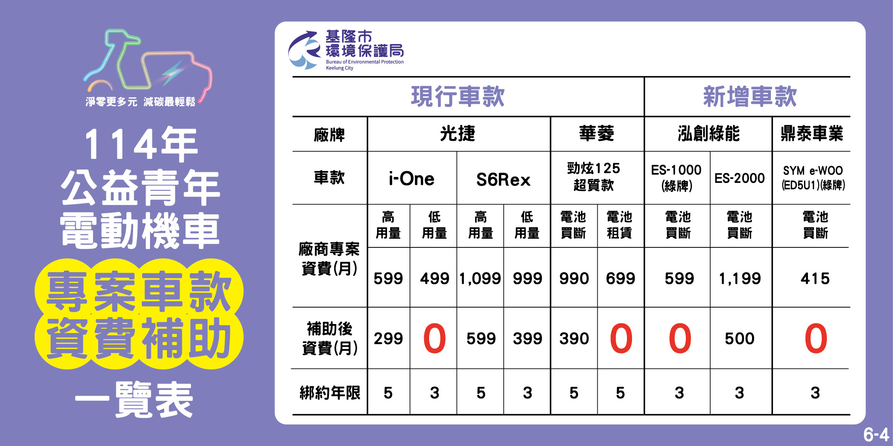

# 114年公益青年電動機車申請

Apr 1, 2025

### 👴 適合長者的選擇條件

對 50–60 歲長者來說，選擇車款時可優先考慮：

1. **操控簡單、好騎乘**

2. **不需頻繁充電／換電**

3. **車身穩定，重心低**

4. **後勤維修據點夠多**

5. **綁約期越短越好**

### 🏆 **推薦排序（針對50-60歲長者）**

#### 🥇 **鼎泰車業 SYM e-WOO (ED5U1)**

- ✅ 月資費 0 元

- ✅ 綁約 3 年（短）

- ✅ **SYM 是知名大廠，維修據點多**

- ✅ 採「電池買斷」：免換電站，更適合不熟科技的長輩

- ✅ 車款偏向通勤型，外型穩重，較好操控

#### 🥈 **泓創綠能 ES-1000（綠牌）**

- ✅ 月資費 0 元

- ✅ 綁約 3 年

- ❓品牌較小，維修據點相對有限

- ⚠ 車型資訊有限，需再實地試乘了解是否穩定好騎

#### 🥉 **華菱 勁炫125**

- ✅ 月資費 0 元

- ❌ 綁約 5 年（較長）

- ✅ 電池買斷，維修應有基本保障

- ❓品牌維修據點需確認

#### ❗不建議：**光捷 i-One（低用量）**

- 雖是 0 元方案

- ❌ 為光捷品牌，定位偏輕量型、設計偏年輕

- ❌ 電池系統可能需經常換電站支援，長輩使用不便

---

### ✅ **總結推薦**

最適合 50–60 歲長者的 0 元方案為：

> ✅ **SYM e-WOO (ED5U1)**：維修方便、品牌信任高、月費 0 元、3 年綁約，CP 值最高。