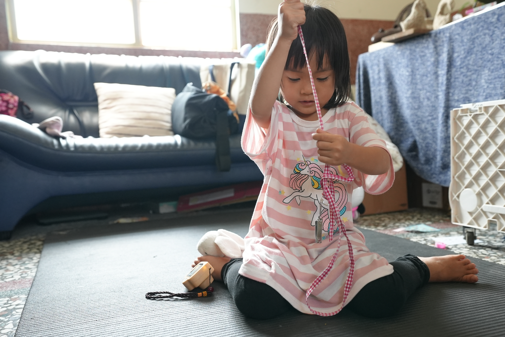
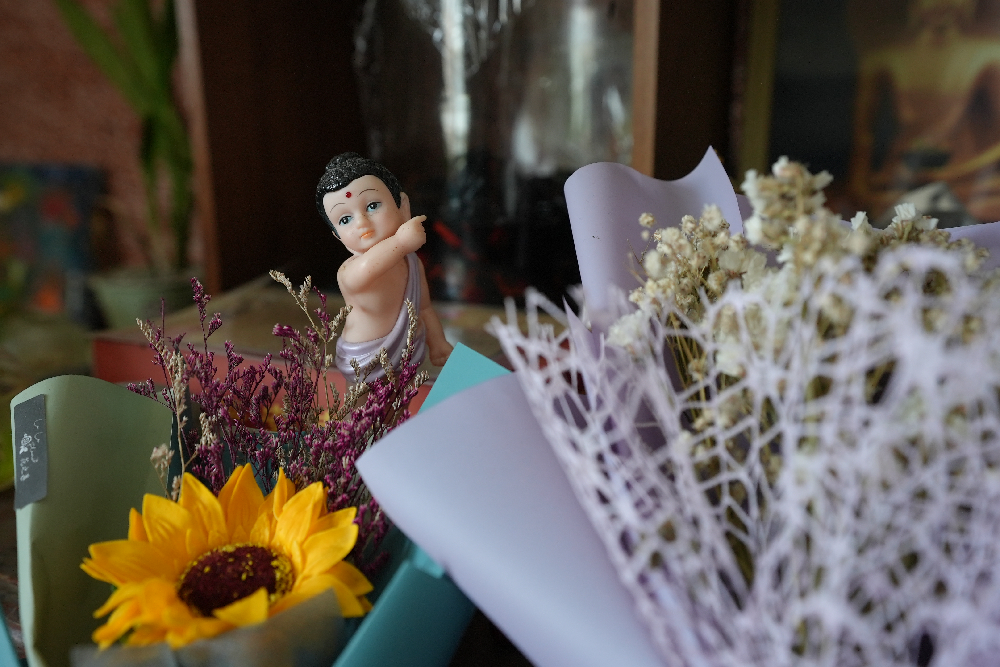
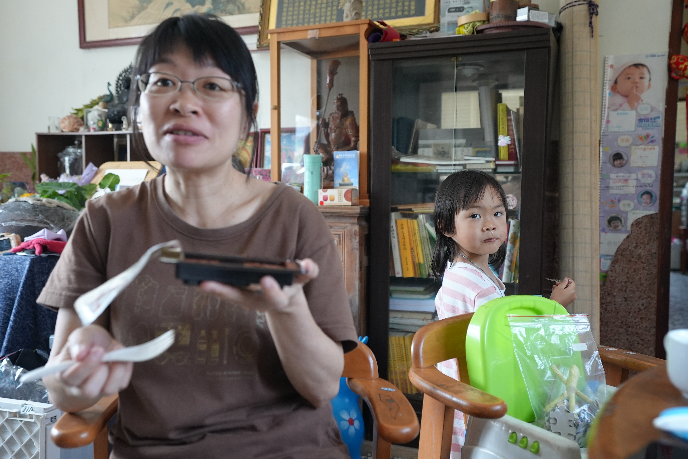

# 照片故事集

> 這是一個關於生活、關於愛的視覺敘事，每一張照片都承載著獨特的故事和情感。

## #1

- 相機：SONY ILCE-7SM3
- 鏡頭：FE 16-35mm F2.8 GM
- 焦距：32mm
- 光圈：ƒ/4.0
- 快門：1/160s
- ISO：ISO 1600
- 拍攝時間：2025年3月25日 下午11:26

在這片寧靜的時光中，陽光溫柔地灑落在每一片葉子上，彷彿在訴說著大自然的秘密。這是一個關於成長、關於愛的故事，就像《編織勝草》中描述的那樣，每一刻都充滿了生命的奇蹟。

---

## #2

- 相機：SONY ILCE-7SM3
- 鏡頭：FE 16-35mm F2.8 GM
- 焦距：32mm
- 光圈：ƒ/4.0
- 快門：1/160s
- ISO：ISO 1000
- 拍攝時間：2025年3月25日 下午11:27

微風輕拂，帶來遠方的氣息。這張照片捕捉了生活中最純粹的瞬間，讓我們停下腳步，感受當下的美好。正如基默爾所說：「在寂靜中，我們聽見了生命的低語。」

---

## #3

- 相機：SONY ILCE-7SM3
- 鏡頭：FE 16-35mm F2.8 GM
- 焦距：32mm
- 光圈：ƒ/4.0
- 快門：1/160s
- ISO：ISO 4000
- 拍攝時間：2025年3月25日 下午11:28

這是一個關於連結的故事，關於我們如何與自然、與彼此建立深厚的關係。每一幀畫面都是一個新的開始，一個新的發現。

---

## #4

- 相機：SONY ILCE-7SM3
- 鏡頭：FE 16-35mm F2.8 GM
- 焦距：32mm
- 光圈：ƒ/3.5
- 快門：1/160s
- ISO：ISO 1250
- 拍攝時間：2025年3月25日 下午11:32

這張照片捕捉了一個特別的時刻，讓我們一起感受這份溫暖與寧靜。在這個瞬間，時光彷彿靜止，讓我們能夠細細品味生活中的每一個細節。

---

## #5

- 相機：SONY ILCE-7SM3
- 鏡頭：FE 16-35mm F2.8 GM
- 焦距：35mm
- 光圈：ƒ/3.5
- 快門：1/160s
- ISO：ISO 1250
- 拍攝時間：2025年3月25日 下午11:32

這張照片捕捉了一個特別的時刻，讓我們一起感受這份溫暖與寧靜。在這個瞬間，時光彷彿靜止，讓我們能夠細細品味生活中的每一個細節。

---

## #6

- 相機：SONY ILCE-7SM3
- 鏡頭：FE 16-35mm F2.8 GM
- 焦距：35mm
- 光圈：ƒ/4.0
- 快門：1/160s
- ISO：ISO 3200
- 拍攝時間：2025年3月25日 下午11:33

這張照片捕捉了一個特別的時刻，讓我們一起感受這份溫暖與寧靜。在這個瞬間，時光彷彿靜止，讓我們能夠細細品味生活中的每一個細節。

---

## #7

- 相機：SONY ILCE-7SM3
- 鏡頭：FE 16-35mm F2.8 GM
- 焦距：35mm
- 光圈：ƒ/4.0
- 快門：1/60s
- ISO：ISO 500
- 拍攝時間：2025年3月25日 下午11:34

這張照片捕捉了一個特別的時刻，讓我們一起感受這份溫暖與寧靜。在這個瞬間，時光彷彿靜止，讓我們能夠細細品味生活中的每一個細節。

---

## #8

- 相機：SONY ILCE-7SM3
- 鏡頭：FE 16-35mm F2.8 GM
- 焦距：35mm
- 光圈：ƒ/4.0
- 快門：1/60s
- ISO：ISO 500
- 拍攝時間：2025年3月25日 下午11:34

這張照片捕捉了一個特別的時刻，讓我們一起感受這份溫暖與寧靜。在這個瞬間，時光彷彿靜止，讓我們能夠細細品味生活中的每一個細節。

---

## #9

- 相機：SONY ILCE-7SM3
- 鏡頭：FE 16-35mm F2.8 GM
- 焦距：35mm
- 光圈：ƒ/4.0
- 快門：1/60s
- ISO：ISO 640
- 拍攝時間：2025年3月25日 下午11:35

這張照片捕捉了一個特別的時刻，讓我們一起感受這份溫暖與寧靜。在這個瞬間，時光彷彿靜止，讓我們能夠細細品味生活中的每一個細節。

---

## #10

- 相機：SONY ILCE-7SM3
- 鏡頭：FE 16-35mm F2.8 GM
- 焦距：35mm
- 光圈：ƒ/4.0
- 快門：1/160s
- ISO：ISO 1600
- 拍攝時間：2025年3月25日 下午11:35

這張照片捕捉了一個特別的時刻，讓我們一起感受這份溫暖與寧靜。在這個瞬間，時光彷彿靜止，讓我們能夠細細品味生活中的每一個細節。

---

## #11

- 相機：SONY ILCE-7SM3
- 鏡頭：FE 16-35mm F2.8 GM
- 焦距：35mm
- 光圈：ƒ/3.2
- 快門：1/160s
- ISO：ISO 1250
- 拍攝時間：2025年3月25日 下午11:36

這張照片捕捉了一個特別的時刻，讓我們一起感受這份溫暖與寧靜。在這個瞬間，時光彷彿靜止，讓我們能夠細細品味生活中的每一個細節。

---

## #12

- 相機：SONY ILCE-7SM3
- 鏡頭：FE 16-35mm F2.8 GM
- 焦距：35mm
- 光圈：ƒ/4.0
- 快門：1/160s
- ISO：ISO 3200
- 拍攝時間：2025年3月26日 上午12:11

這張照片捕捉了一個特別的時刻，讓我們一起感受這份溫暖與寧靜。在這個瞬間，時光彷彿靜止，讓我們能夠細細品味生活中的每一個細節。

---

## #13

- 相機：SONY ILCE-7SM3
- 鏡頭：FE 16-35mm F2.8 GM
- 焦距：32mm
- 光圈：ƒ/6.3
- 快門：1/400s
- ISO：ISO 80
- 拍攝時間：2025年3月26日 上午12:32

這張照片捕捉了一個特別的時刻，讓我們一起感受這份溫暖與寧靜。在這個瞬間，時光彷彿靜止，讓我們能夠細細品味生活中的每一個細節。

---

## #14

- 相機：SONY ILCE-7SM3
- 鏡頭：FE 16-35mm F2.8 GM
- 焦距：32mm
- 光圈：ƒ/4.5
- 快門：1/200s
- ISO：ISO 80
- 拍攝時間：2025年3月26日 上午12:32

這張照片捕捉了一個特別的時刻，讓我們一起感受這份溫暖與寧靜。在這個瞬間，時光彷彿靜止，讓我們能夠細細品味生活中的每一個細節。

---

## #15

- 相機：SONY ILCE-7SM3
- 鏡頭：FE 16-35mm F2.8 GM
- 焦距：32mm
- 光圈：ƒ/4.0
- 快門：1/250s
- ISO：ISO 80
- 拍攝時間：2025年3月26日 上午12:33

這張照片捕捉了一個特別的時刻，讓我們一起感受這份溫暖與寧靜。在這個瞬間，時光彷彿靜止，讓我們能夠細細品味生活中的每一個細節。

---

