# 日常的美感

> 這是一個關於生活、關於愛的視覺敘事，每一張照片都承載著獨特的故事和情感。

## #01

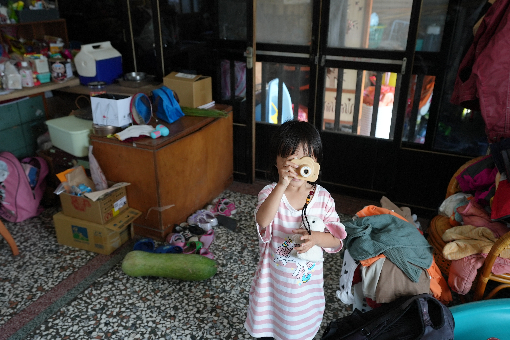

站在家中一隅，女孩舉機拍照，凌亂中藏著家的溫暖與生活的真實節奏。

---

## #02

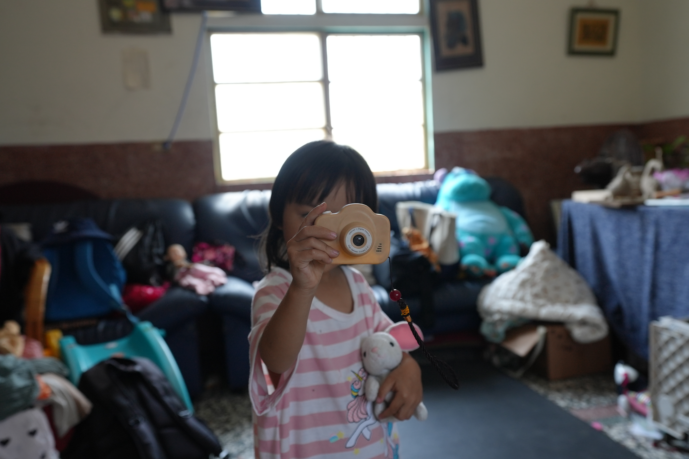

她抱著玩偶，用小相機拍著鏡頭，純真無畏，像是在說：輪到我來記錄你了。

---

## #03

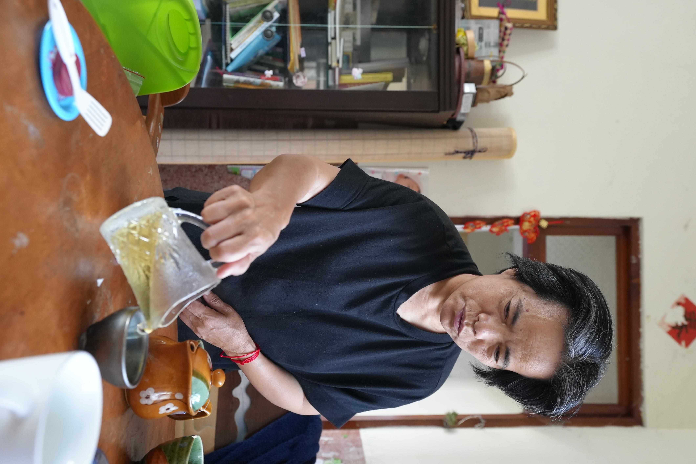

大人沖著茶，神情專注，茶香飄散在這日常中，一如時光慢慢沉澱的模樣。

---

## #04

她的笑容透過玩具相機一閃而過，小白兔靜靜陪著，是她的觀眾，也是伙伴。

---

## #05

她舉起玩具相機，假裝拍照的瞬間，彷彿在學習記錄這世界的樣子。

---

## #06

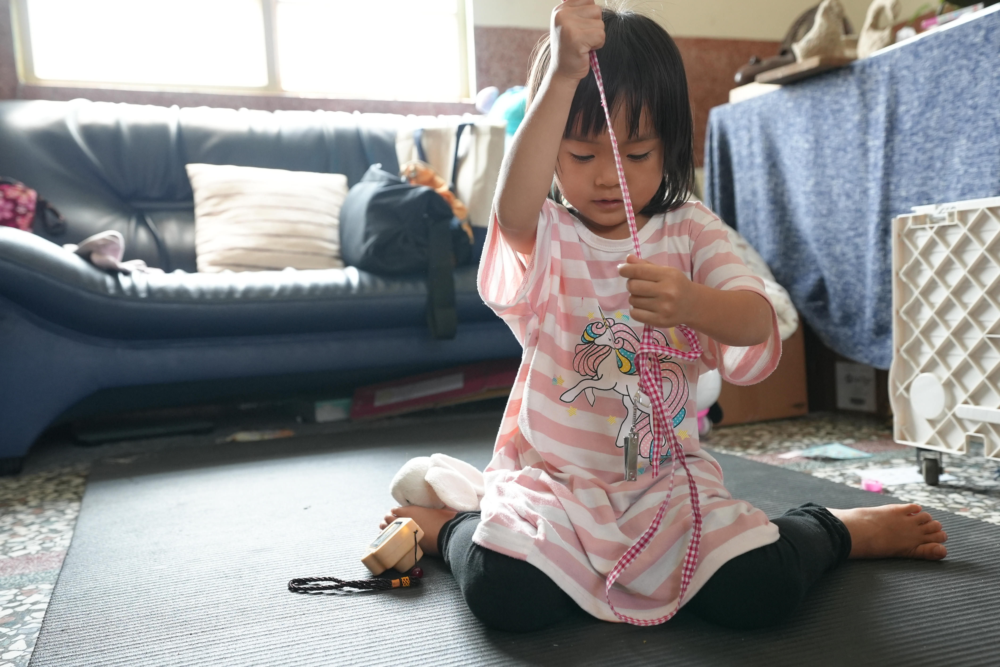

女孩盤腿坐在墊上，專注理著繩子，童年就是這樣一場安靜又豐富的遊戲。

---

## #07

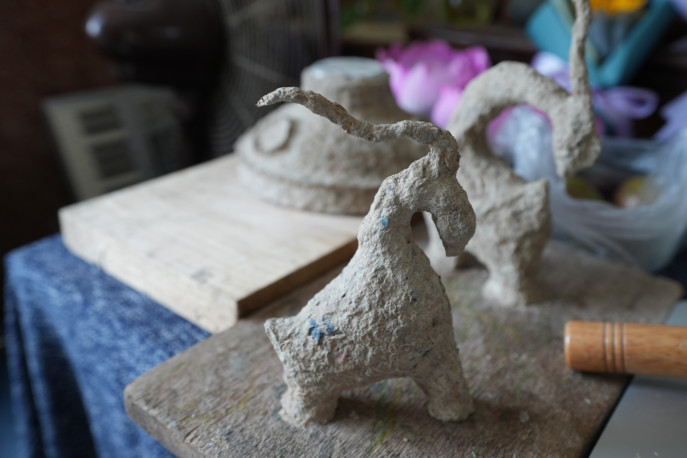

轉個角度，雕塑依然生動，背景的蓮花與木槌點綴著手工與生活的交會。

---

## #08

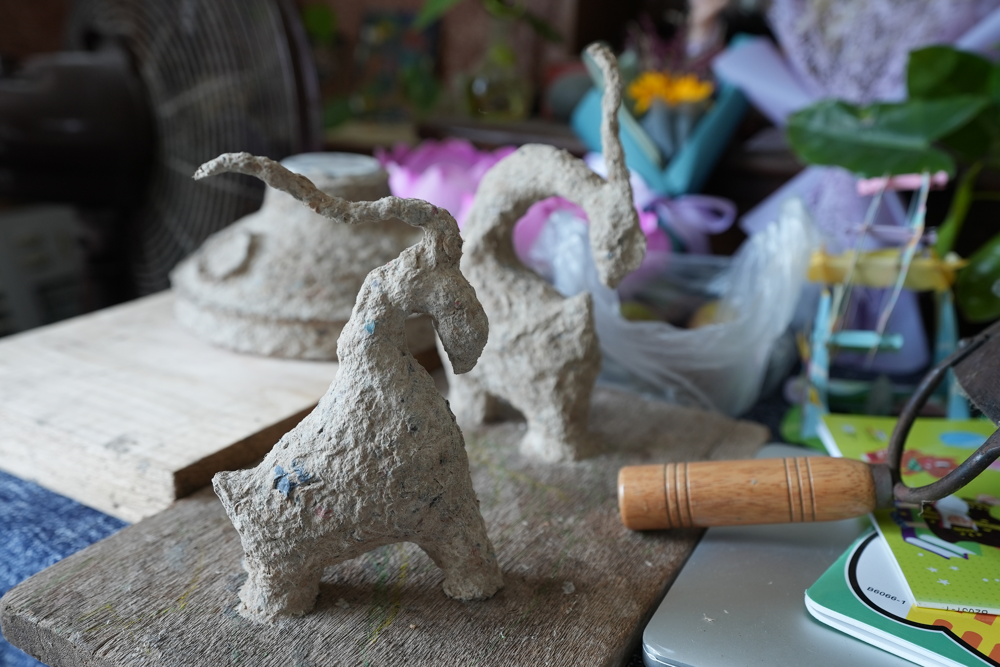

粗獷質感的紙漿雕塑，像是野獸般靜靜站立，時間在它身上留下創作的痕跡。

---

## #09

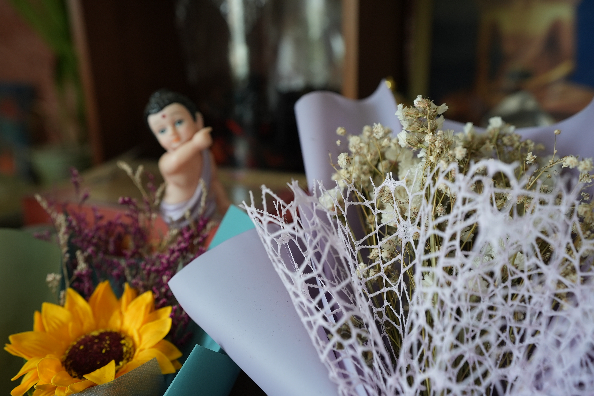

細膩乾燥花與彩紙交錯，童佛在後方模糊守望，靜謐與祝福悄然流動。

---

## #10

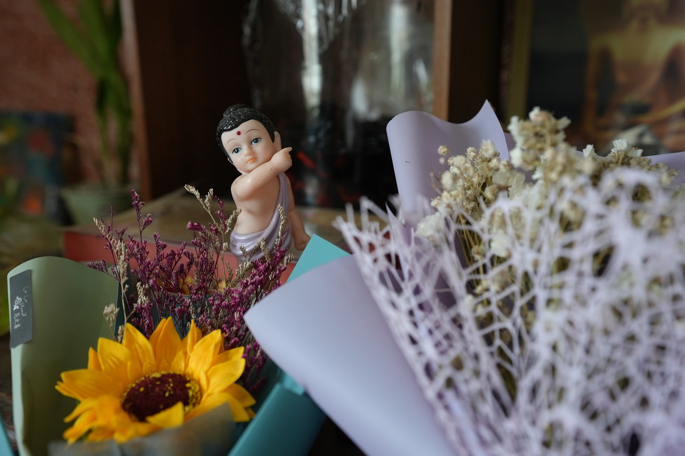

童佛指天而立，花束簇擁著，彷彿在祝福每位走入生活的人心境平和。

---

## #11

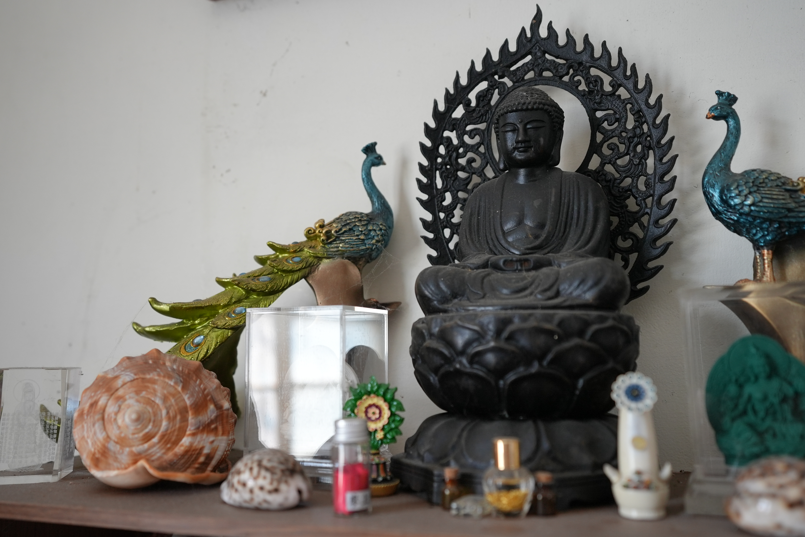

莊嚴的佛像與兩側孔雀雕飾靜靜佇立，香氣與時光在這一角凝結。

---

## #12

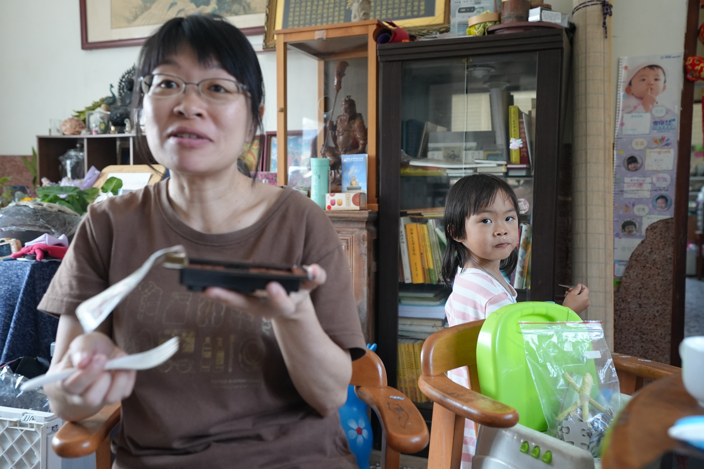

屋內擺滿書櫃與生活物件，小女孩望向鏡頭，一幕家常溫柔的午後光景。

---

## #13

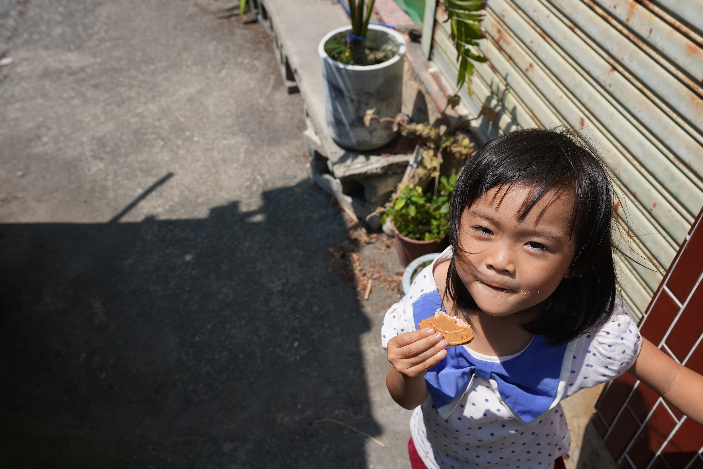

從高處俯視，女孩仰頭看鏡頭，嘴角沾著餅乾碎屑，露出俏皮又自在的神情。

---

## #14

女孩輕步走過牆角綠意，嘴裡咬著餅乾，陽光在她髮梢跳舞，彷彿生活的詩篇。

---

## #15

陽光下的小院子裡，小女孩拿著餅乾露出燦爛笑容，彷彿整個午後都因她而溫暖。

---

